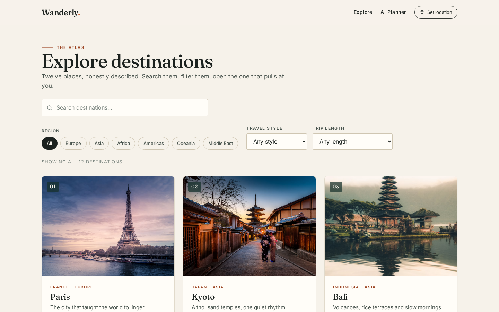
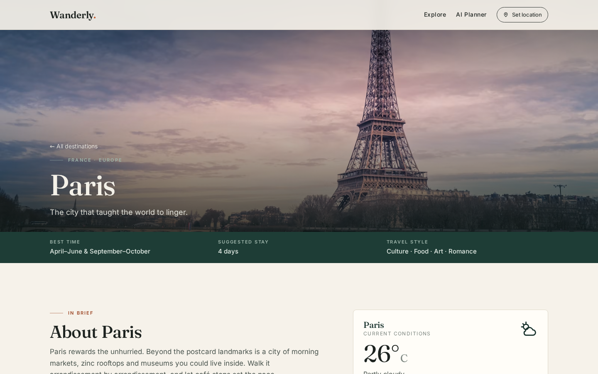
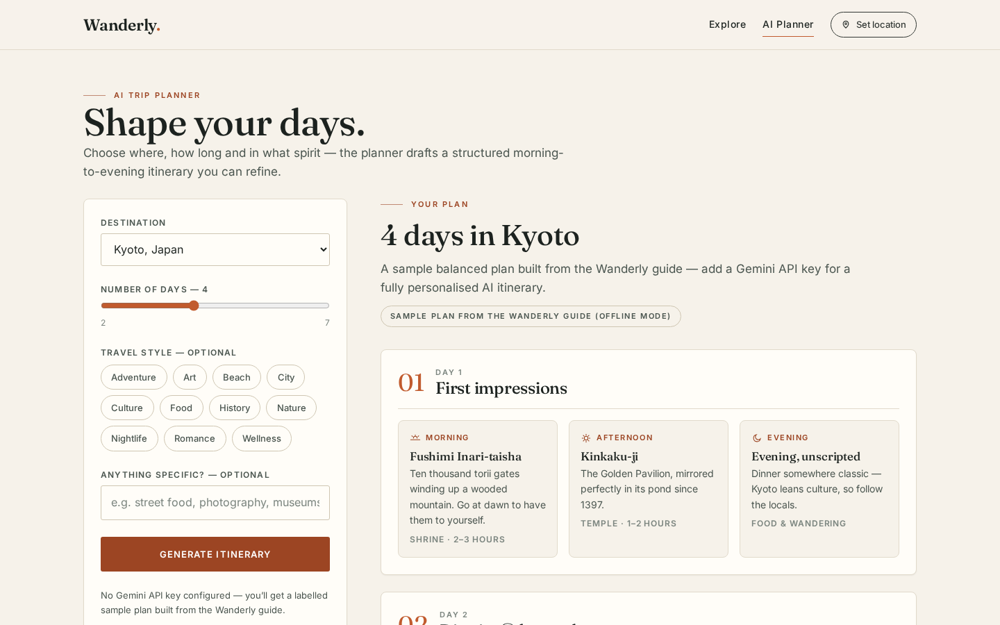
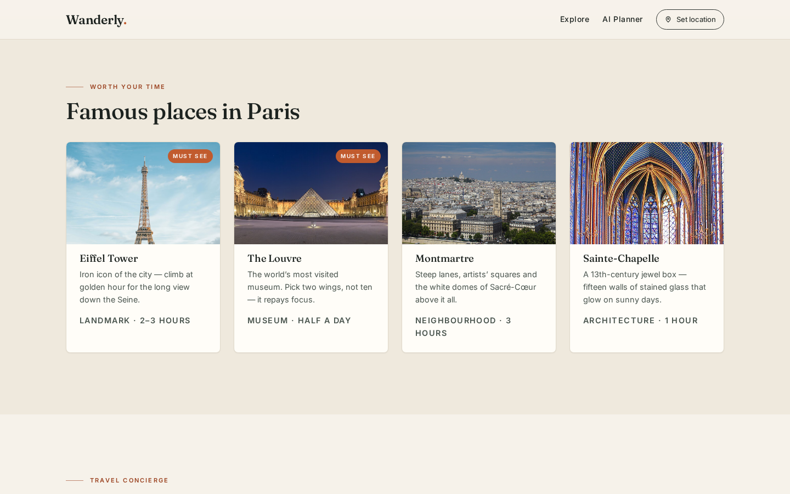
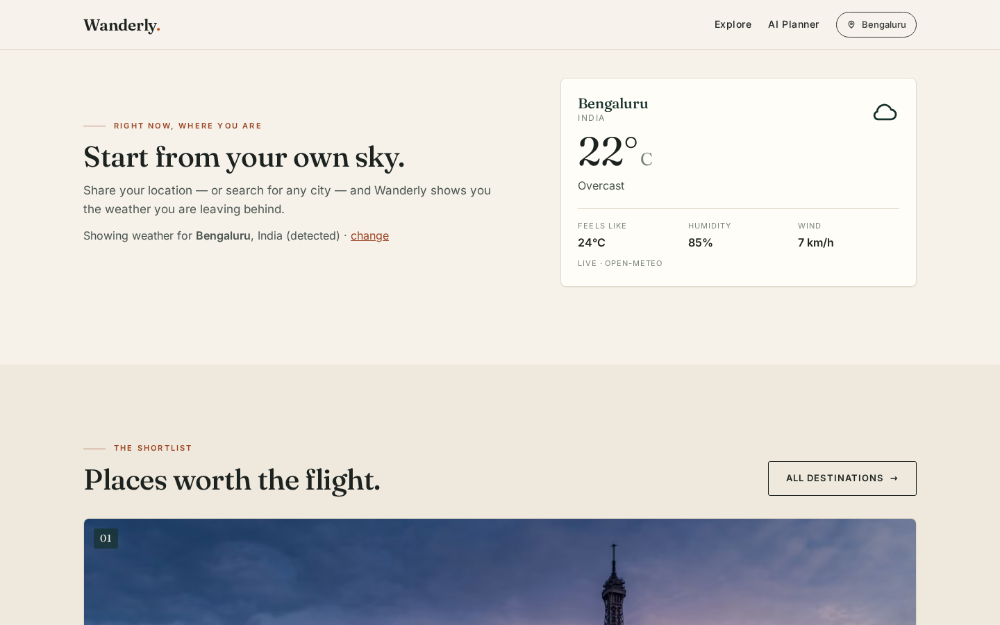
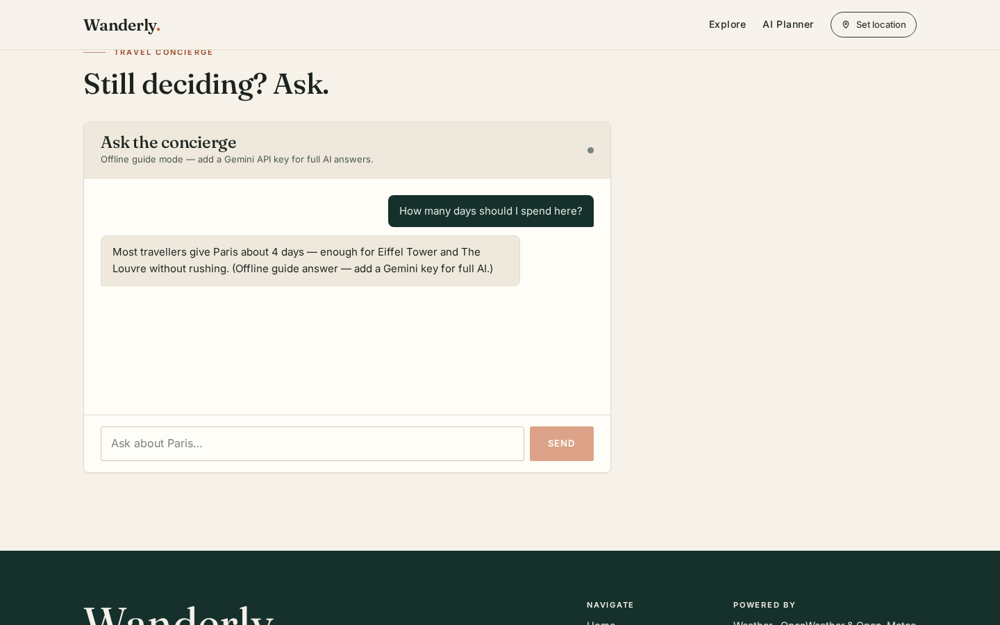
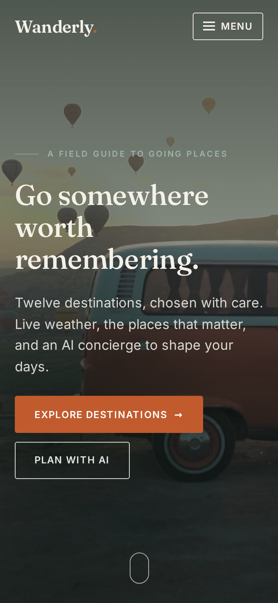
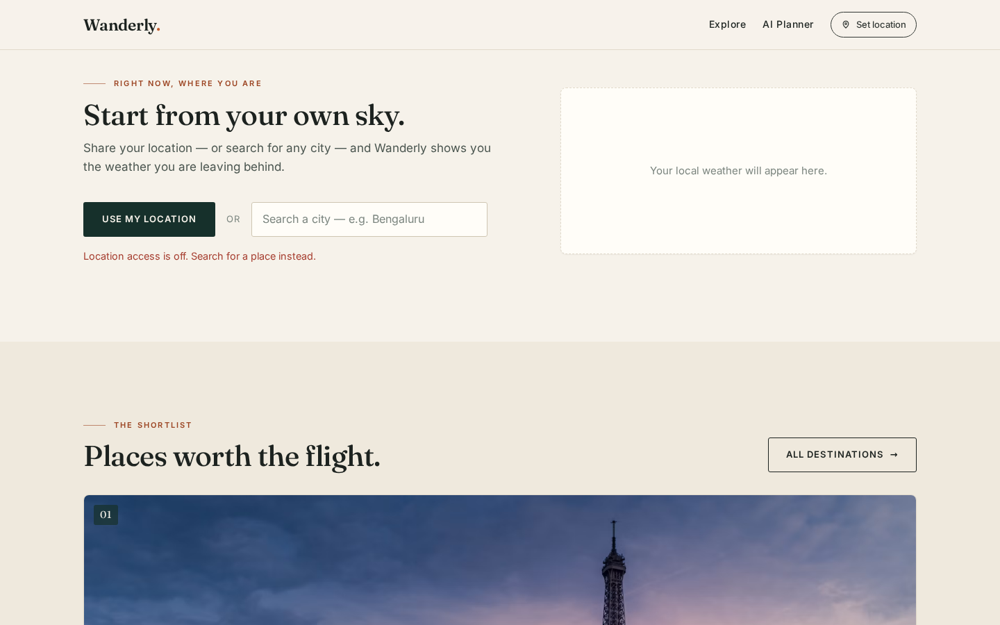
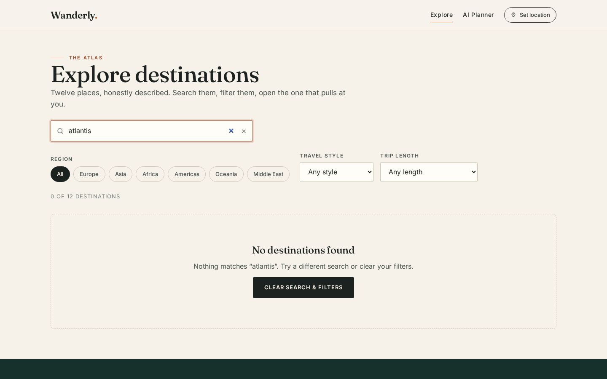

<div align="center">

# 🧭 Wanderly

### *Go somewhere worth remembering.*

A premium travel discovery app — curated destinations, live weather,
dynamic photography, an AI travel concierge, and structured day-by-day
AI itineraries. Built in React.

<br/>

**[🌍 View the Live Site](https://anushamamidiece-max.github.io/wanderly/)** &nbsp;·&nbsp;
**[📦 Source Code](https://github.com/anushamamidiece-max/wanderly)**

<br/>


<br/>


</div>

---

## ✨ What it does

Wanderly was built as a Front-End Developer assessment for **Design
Esthetics** (via TAP Academy) — a travel product that feels like a travel
magazine, not a booking site.

| | Feature | Details |
|---|---|---|
| 🎬 | **Cinematic landing** | Full-viewport looping background video (Pexels CDN, free licence) with graceful photo fallback, scroll cue, and a navbar that turns solid on scroll |
| 🗺️ | **Destination explorer** | 12 curated destinations · live search (case-insensitive, partial match) · region / travel-style / trip-length filters · designed empty state with one-click reset |
| 📖 | **Editorial detail pages** | Routed with React Router (`/destination/:id`) — cinematic header, quick facts, live weather, famous places, AI concierge. Unknown ids → designed 404 |
| 🏛️ | **Famous places** | Visual cards (photo · description · category · visit time · "must see" badge). Photos fetched **dynamically from the Wikipedia REST API** — always the real landmark |
| 📍 | **Location awareness** | Geolocation requested **only on click** (no permission ambush) → reverse-geocoded to a city name → live local weather. Denied permission is a *designed state*, and manual city search works either way |
| 🌦️ | **Real-time weather** | Temperature, condition, feels-like, humidity, wind — OpenWeather when a key exists, transparent fallback to keyless Open-Meteo, one normalised shape |
| 🤖 | **AI concierge** | Gemini-powered chat that knows which destination you're reading — suggested prompts, typing indicator, error states, `aria-live` log |
| 📅 | **AI itinerary generator** | Destination + days (2–7) + styles + interests → Gemini returns strict JSON → **validated** → rendered as Day → Morning / Afternoon / Evening cards. Never a wall of chat text |
| 🧯 | **Designed failure states** | Loading skeletons, empty results, failed requests with retry, denied location, image fallbacks, 404 — every state is designed, not accidental |
| 📱 | **Responsive** | Intentional layouts from 320 px to large desktop — collapsible menu, filter drawer, sticky planner form |
| ♿ | **Accessible** | Semantic landmarks, labelled inputs, alt text, visible focus rings, skip link, keyboard-only usable, `prefers-reduced-motion` respected |

---

## 📸 Screenshots

| Explorer | Destination page | AI itinerary |
|:---:|:---:|:---:|
|  |  |  |

| Famous places | Live weather (my location) | AI concierge |
|:---:|:---:|:---:|
|  |  |  |

| Mobile | Location denied (designed) | Empty state (designed) |
|:---:|:---:|:---:|
|  |  |  |

---

## 🔌 APIs

Every integration lives in its own service module (`src/services/`) and is
normalised to one shape — components never know which provider answered.
**Every feature has a keyless fallback**, so a missing key degrades one
feature gracefully instead of breaking the page.

| Purpose | Primary | Keyless fallback |
|---|---|---|
| Weather | [OpenWeather](https://openweathermap.org/) | [Open-Meteo](https://open-meteo.com/) |
| Place photos | [Wikipedia REST API](https://en.wikipedia.org/api/rest_v1/) *(keyless)* | designed placeholder |
| Destination covers | [Unsplash API](https://unsplash.com/developers) *(optional)* | curated Unsplash CDN |
| AI chat + itineraries | [Google Gemini](https://ai.google.dev/) | labelled offline guide mode |
| City search | Open-Meteo Geocoding *(keyless)* | — |
| Reverse geocoding | BigDataCloud *(keyless)* | — |
| Geolocation | Browser Geolocation API | manual city search |

---

## 🚀 Getting started

```bash
git clone https://github.com/anushamamidiece-max/wanderly.git
cd wanderly
npm install
cp .env.example .env      # add your keys (optional — see below)
npm run dev               # → http://localhost:5173
```

> 💡 The app runs **without any keys** — weather via Open-Meteo, photos via
> Wikipedia, and the AI switches to a clearly-labelled offline guide mode.

### Environment variables

| Variable | Unlocks | Get it at |
|---|---|---|
| `VITE_GEMINI_API_KEY` | AI chat + AI itineraries | [Google AI Studio](https://aistudio.google.com/apikey) |
| `VITE_OPENWEATHER_API_KEY` | OpenWeather as weather source *(optional)* | [openweathermap.org](https://openweathermap.org/api) |
| `VITE_UNSPLASH_ACCESS_KEY` | Fresh Unsplash covers *(optional)* | [unsplash.com/developers](https://unsplash.com/developers) |

`.env` is git-ignored — **no keys are committed to this repository.**

> **An honest note on client-side keys:** `VITE_` variables are embedded in
> the shipped bundle, so they are visible in dev tools. Keys stay out of
> git (easy rotation, no GitHub scraping), but a production build would move
> AI/weather calls behind a small serverless proxy. For this assessment the
> practical setup is restricted free-tier keys plus keyless fallbacks.

---

## 🌐 Deployment

Live on **GitHub Pages** from the `gh-pages` branch:

```bash
npm run build -- --base=/wanderly/   # production build with Pages base path
# dist/index.html is copied to dist/404.html so deep links
# like /wanderly/destination/kyoto survive a refresh
```

The app also deploys unchanged to **Vercel / Netlify** — `vercel.json`
already provides the SPA rewrites.

---

## 🗂️ Project structure

```
src/
├── components/    Navbar · Hero · DestinationCard · FamousPlaceCard · SearchBar
│                  FilterBar · WeatherCard · WeatherIcon · LocationPanel
│                  Chatbot · Itinerary · SmartImage · Reveal · States
├── pages/         Home · Explore · DestinationDetail · Planner · NotFound
├── context/       LocationContext — shared "where is the traveller?" state
├── hooks/         useWeather — loading / data / error for any coordinates
├── services/      weatherService · imageService · aiService · locationService
├── data/          destinations.js — curated 12-destination guide dataset
└── styles/        variables.css · globals.css · components.css · pages.css
```

---

## 🎨 Design decisions

- **Editorial, not booking-site** — warm paper, deep pine + terracotta,
  display serif headlines, hairline rules, uppercase eyebrows, whitespace.
  The whole design system is CSS custom properties in `variables.css`.
- **Wikipedia as an image source** — stock-photo searches often return the
  wrong landmark; the Wikipedia article's lead photo is correct by
  construction. (Two articles lead with logos — Eiffel Tower, Vatican
  Museums — so those pin curated photos. Wikimedia serves only fixed
  thumbnail widths, so the service picks the largest valid bucket.)
- **AI output you can render** — Gemini is asked for strict JSON, parsed
  defensively (fence-stripping, brace extraction) and validated field by
  field before it touches the UI. Malformed output → designed error.
- **Honest offline mode** — without a key the app never fakes AI: chat
  answers come from the guide dataset and itineraries carry a
  *"sample plan (offline mode)"* badge.
- **Motion with intent** — one IntersectionObserver reveal pattern,
  restrained hovers, full `prefers-reduced-motion` support.

---

## 🔮 Future improvements

- Serverless proxy for AI/weather calls so keys never ship to the browser
- Save itineraries (localStorage → accounts) and export to PDF
- 5-day forecast strip on destination pages
- Streaming chat responses
- Unit tests for the itinerary validator and search/filter logic

---

<div align="center">

Built with care as an original implementation for the Design Esthetics
front-end assessment — **[open the live site →](https://anushamamidiece-max.github.io/wanderly/)**

</div>
